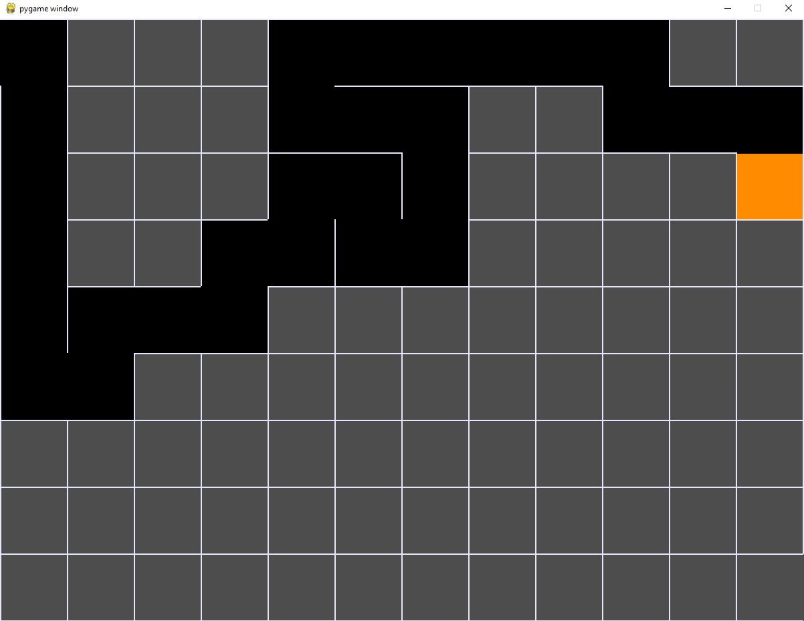
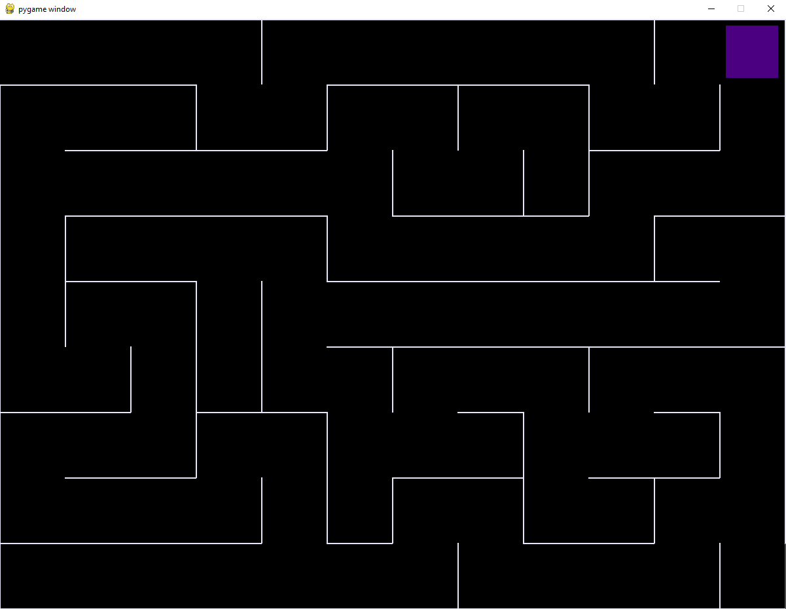

# Maze Generator and Solver
 This project is a program that generates a maze and then solves itself. Built with PyGame.

# How does the program work?
- The program starts off by generating a maze from a grid of cells. The orange cell is the cell that generates the maze.

- It will then backtrack after all cells have been visited through the generation until it reaches the starting cell.

- After 1 second, the maze will then solve itself using DFS. The purple cell is the solver cell.

- The start position is Cell (0, 0) and the solver cell will try to get to the last Cell (cols - 1, rows - 1). Basically, it tries to path from the top-left to the bottom-right.

- After the maze is solved, the terminal will show "YOU FOUND THE PATH!". It will wait for 5 seconds, then close the program.

- Each maze is unique, due to `choice()` function in `random` library in Python.

- Mazes can become larger if the `TILE` constant at the top is changed to a lower number. 

- Conversly, mazes can become smaller if the `TILE` constant is changed to a higher number.

### NOTE: There are some delays intentionally added near the end of the generation and solving state so that the user can view it properly. 
- The generator is also faster than the solver. If you wish to change it, update the `clock.tick()` function to a higher number

# Bugs
- There are only visual bugs due to PyGame. No matter what I try, the program will not visually update the first cell when trying to backtrack to the first cell on generation. And when solving is completed, the solver cell visually looks like it is 1 cell behind completion.
- The bug has been isolated to the if condition when switching states and when completion occurs
  - Generation: `if (not stack and nextCell == False):`
  - Solving: `if (currentCell.x == cols - 1 and currentCell.y == rows - 1):`
- These if conditions create the visual error, presumably due to PyGame. The visuals are not updated fast enough and despite the flags or counts that are placed, nor if conditions that are changed and delays/pygame.updates() are added, they do not visually reach their goal. But when logging, each cell is satisfying their respective if conditions
